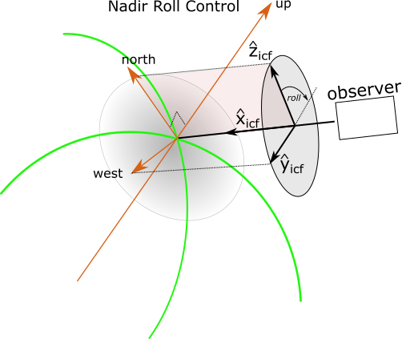

.. _platforms_model:

###################
The Platforms Model
###################
The ``skretrieval.platforms`` package provides support to simulate platforms such as spacecraft, aircraft, balloons and
ground-based sites. Instruments are mounted on platforms at given orientations, similar to how physical instruments are
bolted on to real platforms, and the platform is positioned and rotated to collect the desired set of measurements.

Its goal within the ``skretrieval`` framework is to assist in the generation of the set of times, positions and look vectors
given to :ref:`forwardmodel`. Users who have their own techniques for calculating positions and look vectors for the
:ref:`forwardmodel` can continue using their own code or, if they wish, switch over to using the :class:`~.Platform` class.

Class :class:`~.Platform` provides access to two primary aspects,

    #. Simulation of various platforms used in remote atmospheric sensing.
    #. Generation of sets of platform position and orientation using various positioning and pointing techniques.

The :class:`~.Platform` class utilizes several :ref:`controlframes` and provides rotation matrices to transform between the
frames. The user will typically define instrument lines of sight in the :ref:`icf`. The instrument is optionally
mounted on a platform and the platform rotated in space and time to execute the desired measurement plan. Users will normally
transform the instrument look vectors to the :ref:`ecef` for input to radiative transfer codes but the platform can also
transform the look vector to the local geodetic control frame or platform control frame if preferred.

Class :class:`~.Platform` provides a high level interface which can be used to calculate platform positions and
orientations needed to simulate a set of measurements. The class, as provided out-of-the-box, provides access to a library
of common techniques that that should meet most user needs but the API allows new techniques to be developed and added
by users. The problem usually reduces into two parts,

    #. selection of an instrument positioning technique.
    #. selection of an instrument pointing technique.

Example
=======
Consider a simulation where an instrument onboard a sun-synchronous satellite at an altitude of 600 km needs to look in the
limb at a tangent point at 35 km altitude over Saskatoon, Saskatchewan, located at (52.0N, -107.0E). The observation
will be made at approximately 2020-07-15 15:00 UTC. The satellite is configured so the instrument is always looking
at a bearing of 45 degrees from local North at the satellite location.

We shall demonstrate three techniques that could be used to *solve* the problem.  The three techniques are based
upon significantly different algorithms but, from the user's perspective, are implemented in an almost identical manner.

Option 1: llh
-------------
Use the :class:`~.Platform` class with no special configuration. Set the time and position of the
satellite with the :ref:`llh` positioning technique.  Then configure the platform orientation with the
:ref:`tangent_altitude` pointing technique using :ref:`rollcontrol_limb` roll control so it is looking at that tangent
point. This will generate the required position and look vector for the given conditions. The option has the limitation
that it is difficult to choose the position of the platform so the tangent point is over Saskatoon::

    from skretrieval.platforms import Platform

    platform = Platform()
    utc = ['2020-07-15T15:00:00.0000000']
    observer = [52.0, -107.0, 600000.0]
    tanpoint = [35000.0, 45.0]
    platform.add_measurement_set(utc, ('llh', observer), ('tangent_altitude', 'limb', tanpoint))
    opticalmeasurements = platform.make_optical_geometry()

If you want to print out the location of the satellite and the tangent point you can use the following snippet of code::

    import sasktran as sk

    geo = sk.Geodetic()
    entry = opticalmeasurements[0]
    geo.from_xyz(entry.observer)
    obslat = geo.latitude
    obslng = geo.longitude
    obshgt = geo.altitude / 1000.0
    geo.from_tangent_point(entry.observer, entry.look_vector)
    tanlat = geo.latitude
    tanlng = geo.longitude
    tanhgt = geo.altitude / 1000.0
    print('Satellite location = ({:5.2f}N,{:6.2f}E) at a height of {:6.2f} km'.format(obslat, obslng, obshgt))
    print('Tangent location   = ({:5.2f}N,{:6.2f}E) at a height of {:6.2f} km'.format(tanlat, tanlng, tanhgt))

and you should get::

    Satellite location = (52.00N,253.00E) at a height of 600.00 km
    Tangent location   = (63.65N,291.78E) at a height of  35.00 km

The tangent point is at 35 km as requested but it is not over Saskatoon, which is not surprising as we, perhaps erroneously,
put the satellite directly over Saskatoon. To get the tangent point directly over Saskatoon you could iteratively adjust the satellite
position until you find teh right locations. But there is an easier way demonstrated below in option 2.

Option 2: looking_at_llh
------------------------
The second option provides a more sophisticated technique to position the satellite so the resultant tangent
point will end up above Saskatoon. In this case set the time and position of the satellite are set with the :ref:`looking_at_llh`
positioning technique; this technique has 5 parameters that position the satellite at the requested altitude so it will
have the requested tangent altitude at the requested location with the requested bearing. It then configures the platform
orientation with the :ref:`tangent_altitude` pointing technique using :ref:`rollcontrol_limb` roll control so it is looking at that tangent
point::

    from skretrieval.platforms import Platform

    platform = Platform()
    utc = ['2020-07-15T15:00:00.0000000']
    observer = [52.0, -107.0, 35000.0, 45.0, 600000.0]
    tanpoint = [35000.0, 45.0]
    platform.add_measurement_set(utc, ('looking_at_llh', observer), ('tangent_altitude', 'limb', tanpoint))
    opticalmeasurements = platform.make_optical_geometry()

Examination of the location of the satellite and tangent point using the same code as in option 1 above gives::

    Satellite location = (38.23N,226.13E) at a height of 600.00 km
    Tangent location = (52.02N,252.98E) at a height of  35.00 km

Now the tangent point is above Saskatoon and the satellite has been placed at a location so it is looking toward Saskatoon
at a tangent altitude of 35 km and a bearing of 45 degrees. Note that the tangent point is not "*exactly*" above Saskatoon.
It is off by approx 0.02 degrees which is due to limitations in the algorithm used.

Option 3: satellite
-------------------
This option configures the :class:`~.Platform` class with a sun-synchronous satellite orbit propagator.  the satellite
is *flown* along the orbit track by providing a sequence of 100 universal times at 1 minute intervals. The position of
the platform is now extracted using the :ref:`from_platform` positioning technique while the look vector is still extracted
with the :ref:`tangent_altitude` pointing technique and :ref:`rollcontrol_limb` roll control.
This option requires a bit more setup but allows the user to *fly* the satellite around the Earth and generate other
positions and look vectors::

    mjd0 = sktime.ut_to_mjd('2020-07-15T15:00:00.000000')                                                         # Define the time of the ascending node
    satellite = SatelliteSunSync(mjd0,                                                                             # Create a sun-synchronous satellite
                                 orbittype='sgp4',
                                 period_from_altitude=600000.0,
                                 localtime_of_ascending_node_hours=2.75)
    platform = Platform(platform_locator=satellite)                                                                 # Create a platform which can use the sun-synchronous satellite for its position

    utc = mjd0 + np.arange(0, 100) / 1440.0                                                                         # Get measurements every minute along the orbit starting at the ascending node.
    looktanalt = [(35000.0, 45)]                                                                                    # Look at a tangent altitude of 35 km, at a geographic bearing of 45 degrees at the satellite location. Note, the parameter set will be expanded to N measurements
    platform.add_measurement_set(utc, ('from_platform',), ('tangent_altitude', 'limb', looktanalt))                 # Add the measurement set
    opticalmeasurements = platform.make_optical_geometry()

This technique has the same problem as option 1 in that it is difficult to pre-configure the satellite to fly exactly over Saskatoon
with the proper geometry.  However, we fiddled with the local time of the ascending node of the satellite and if you look at the
38'th entry of the 100 returned ``opticalmeasurement`` values you should see that it has a tangent point close to Saskatoon::

    38 Satellite location = (38.26N,235.59E) at a height of 605.39 km
    38 Tangent location   = (52.09N,262.62E) at a height of  35.00 km

------------------------------------------------------------------------------------------------------------------------

Measurement Sets
================
The user must define what constitutes a set of measurements. This may be as simple as one exposure or something much more
complicated such as a spatial scan of a specific atmospheric region. In our experience, we almost always break
the definition of measurements sets into the following three steps,

    #. Define (or acquire) a set of universal times at which the measurements are made.
    #. Specify (or acquire) the position of the platform associated with each measurement at each universal time.
    #. Specify (or acquire) the pointing of the platform associated with each measurement at each universal time.

Example
-------
Configure a satellite to acquire a height profile of spectra over Saskatoon (52N, -107E) in the summer time from which
atmospheric aerosols can be inferred over Saskatooon .

**Option 1**:  A simple emulator fixes a satellite ~20 degrees south of Saskatoon at 600 km looking northwards in the limb. There
will be 50 measurements scanning from 0 km to 50 km all made at the same location and same time UTC (2020-06-21T18:00:00.000000)

**Option 2:** A sun-synchronous satellite with an ascending node at 12:00LT will fly over Saskatoon on 2020-06-21. It will collect 50 measurements
scanning from 0 to 50 km. The measurements will be one second apart.

The ``skretrieval.platforms`` package can help with both of these scenarios and the user would choose which scenario they
wish to model.

Internal Representation
-----------------------
Measurement sets are internally stored within class :class:`~.Platform` using an instance of :class:`ObservationPolicy`. This
class stores a set of times, position and rotation matrices used for the measurements. This information is independent of the
instrument, apart from its mounting orientation, and cannot be used by retrieval and radiative transfer codes until it is
converted into a set of times, positions and instrument look vectors, such as those found in :class:`~.OpticalGeometry`.

------------------------------------------------------------------------------------------------------------------------

..  _positioning_technique:

Positioning Technique
======================
*Positioning Techniques* are used to specify the position of a platform at a set of measurement times. For example, one technique may specify the position
of a platform using a three element array of geodetic coordinates, :math:`(latitude, longitude, height)`,  while another
technique may specify the same location using a three element array of geocentric coordinates, :math:`(x,y,z)`. The
user chooses which technique they wish to use, see table below.

Coding up the positioning technique consists of the following steps

    #. Determine the number of measurements. This is driven by the number of different platform positions and orientations
    #. Create an array of universal times with one time for each measurement. The times can be the same or they can be different
    #. Create an array of platform position arrays. One array entry is created for each measurement.
    #. Create a tuple whose first element identifies the position technique and the second element is the array of positions.
    #. Pass the array of UTC times and the tuple of position technique into :meth:`~.platform.add_measurement_set` along with orientation info described below.

For example::

    utcarray = ['2020-09-24T12:15:36.123456', '2020-09-24T12:15:37.456123', '2020-09-24T12:15:38.654321', '2020-09-24T12:15:39.654321']
    posarray = [(52, -107, 600000), (53, -107, 600001), (54, -107, 600002), (55,-107, 600003)]
    postechn = ('llh',posarry)
    .
    .
    looktechn = <Various look definition statements, see below>
    .
    .
    platform.add_measurement_set(utcarray, postechn, looktechn)

There are three positioning techniques provided with the ``skretrieval.platforms`` package. Their values are given in
the table below,

=============================== ========================================================================================================
Position Technique              Description
=============================== ========================================================================================================
:ref:`xyz`                      The platform is placed at the geocentric ECEF point given by (x,y,z)
:ref:`llh`                      The platform is placed at the geodetic ECEF location given by (latitude, longitude, height)
:ref:`looking_at_llh`           The platform is placed so it is looking at a given location with a given geographic bearing.
:ref:`from_platform`            The platform is placed at the position of a real instrument or platform simulator using :class:`~.PlatformLocation`.
=============================== ========================================================================================================

The last entry, :ref:`from_platform`, allows users to fetch the platform position at a given universal time from an attached
:class:`~.PlatformLocation` object. This technique is used to model various satellite trajectories,
both real and simulated, and is useful when users wish to simulate measurements as a satellite, aircraft or balloon, moves
along its trajectory.

------------------------------------------------------------------------------------------------------------------------

..  _xyz:

xyz
---
The ``xyz`` positioning technique places the platform at the *N* specified geocentric locations for each measurement in
the parameter array.

..  function:: ( 'xyz',  parameters )

    ``parameters`` is an N element array of three element arrays, ``[array[3], array[3], ...]``.  It is
    anything that can be sensibly coerced into a numpy array of dimension (N,3). All values are expressed in meters in the :ref:`ecef`.

    :param float [0]:
        **x** component of the platform position.
    :param float [1]:
        **y** component of the platform position.
    :param float [2]:
        **z** component of the platform position.

Example::

    from skretrieval.platforms import Platform

    def make_geometry():
        platform = Platform()
        utc  = ['2020-09-24T12:15:36.123456',     '2020-09-24T12:15:37.456123',     '2020-09-24T12:15:38.654321',     '2020-09-24T12:15:39.654321']
        pos  = [(7223456.0,1023456.0, 1423456.0), (7523456.0,923456.0, 1523456.0)   (7223456.0,1023456.0, 1423456.0), (7523456.0,923456.0, 1523456.0)]
        look = [(35000, 10),                      (27000, 5),                       (24000, 0, 0),                    (21000, -5, 0)]

        platform.add_measurement_set( utc, ('xyz', pos), ('tangent_altitude', 'limb', look) )
        obspolicy = platform.make_observation_policy()

------------------------------------------------------------------------------------------------------------------------

..  _llh:

llh
---
The platform is placed at the geodetic location given by the three element tuple, (latitiude, longitude, height), where latitude and
longitude are specified in degrees and height is specified in meters above sea-level.

..  function:: ( 'llh',  parameters )

    ``parameters`` is an N element array of three element arrays, ``[array[3], array[3], ...]``.  It is
    coerced into a numpy array of dimension (N,3).

    :param float [0]:
        **Latitude**. The geodetic latitude of the platform position in degrees.
    :param float [1]:
        **Longitude**. The geodetic longitude of the platform position in degrees. positive East.
    :param float [2]:
        **Height**. The height of the platform above sea-level in meters.

Example::

    from skretrieval.platforms import Platform

    def make_geometry():
        platform = Platform()
        utc  = ['2020-09-24T12:15:36.123456', '2020-09-24T12:15:37.456123', '2020-09-24T12:15:38.654321', '2020-09-24T12:15:39.654321']
        pos  = [(52, -107, 600000),           (53, -107, 600001),           (54, -107, 600002),           (55,-107, 600003)]
        look = [(35000, 10, 0),               (27000, 5, 0),                (24000, 0, 0),                (21000, -5, 0)]

        platform.add_measurement_set( utc, ('llh', pos), ('tangent_altitude', 'limb', look) )
        platform.make_complete_measurement_set()

------------------------------------------------------------------------------------------------------------------------

..  _looking_at_llh:

looking_at_llh
--------------
The platform is placed at the location and height that allows it to view the given target tangent point along the given
geographic bearing.

..  function:: ( 'looking_at_llh',  parameters )

    ``parameters`` is an N element array of five element arrays, ``[array[5], array[5], ...]``.  It is
    coerced into a numpy array of dimension (N,5).

    :param float [0]:
        **Tangent Latitude**. The latitude of the tangent location
    :param float [1]:
        **Tangent Longitude**. The longitude of the tangent location
    :param float [2]:
        **Tangent Altitude**. The height of the tangent above sea-level in meters.
    :param float [3]:
        **Geographic Bearing**. The geographic bearing in degrees of the target from the observer's location. This is
        calculated at the observer's location. 0 is North, 90 is East, 180 is South and 270 is West.
    :param float [4]:
        **Observer Height**. The height of the observer in meters above sea-level.

**Example**. In the following example a satellite is positioned so it is at 600 km altitude and is looking at a bearing of
45 degrees (NE) towards a tangent point at 10 km altitude above (52N, -107E).  A line of sight is chosen so the instrument
is looking in the same geographic bearing at a tangent altitude at 5 km::

    from skretrieval.platforms import Platform

    platform = Platform()
    utc = ['2020-09-24T18:00:00.0000000']
    observer = [52.0, -107.0, 10000.0, 45.0, 600000.0]
    tanpoint = [5000.0, 45.0]
    platform.add_measurement_set(utc, ('observer_looking_at_llh', observer), ('tangent_altitude', 'limb', tanpoint))
    obspolicy = platform.make_observation_policy()

------------------------------------------------------------------------------------------------------------------------

..  _from_platform:

from_platform
-------------
The platform is placed at the position returned by a call to :meth:`~.PlatformLocation.update_position` for the universal time
of each measurement.  The user must configure class :class:`~.Platform` to use the appropriate derived instance
of class :class:`~.PlatformLocation` class that meets their needs.

..  function:: ( 'from_platform', ) or ('from_platform')

    No parameters are required. Parameters can be passed in but are ignored.

Example::

    from skretrieval.platforms import Platform

    def make_geometry():
        platform = Platform()
        utc  = ['2020-09-24T12:15:36.123456', '2020-09-24T12:15:37.456123', '2020-09-24T12:15:38.654321', '2020-09-24T12:15:39.654321']
        look = [(35000, 10, 0),               (27000, 5, 0),                (24000, 0, 0),                (21000, -5, 0)]
        platform.add_measurement_set( utc, ('from_platform',), ('tangent_altitude', 'limb', look) )
        obs_policy = platform.make_observation_policy()

..  seealso::
    Class ER2, class Carmen, class GroundSite, class SatelliteLocator.

------------------------------------------------------------------------------------------------------------------------

..  _rollcontrol:

Roll Control
============
Full specification of the platform orientation in space requires the roll of the instrument :math:`\hat{z}_{ICF}` axis
around the instrument :math:`\hat{x}_{ICF}` axis. The ``skretrieval.orientation_techniques`` package uses of three
methods to determine the location of zero roll, see table below. Each definition has been chosen so the default value of
0.0 corresponds to the value normally chosen for that class of simulations.

=========================== ========================================================================================================
 Roll Control Setting       Description
=========================== ========================================================================================================
:ref:`rollcontrol_limb`     Limb observations: the zero point of roll is parallel to local up at the tangent point.
:ref:`rollcontrol_nadir`    Nadir observations: the zero point of roll is parallel to local north at the given point.
:ref:`rollcontrol_standard` Aircraft, balloon, ground site: the zero point of roll is parallel to local up at the observer location.
=========================== ========================================================================================================

Roll is always measured clockwise when looking along the look vector from the observer's position, i.e. the +Z instrument
axis rotates towards the -Y direction, similar to the roll definition used in aircraft systems.

The roll control value, if required, is provided as one of the parameters given in each pointing technique declaration
and many pointing techniques allow you to omit the value and assume the default value of 0.0.

------------------------------------------------------------------------------------------------------------------------

..  _rollcontrol_limb:

limb
----
The ``limb`` roll control setting is typically used for limb viewing geometries. This setting defines the point of zero roll
as the point where the instrument :math:`\hat{y}_{ICF}` axis is aligned with the horizon at the tangent point. This is determined
by aligning the instrument :math:`\hat{z}_{ICF}` with the vertical unit vector at the tangent point. This ensures
the instrument :math:`\hat{y}_{ICF}` axis is parallel to the horizon and points to the portside of the boresight.

..  figure:: images/limb_target_geometry.png

    Limb control aligns instrument :math:`\hat{z}_{ICF}` with the *up* unit vector at the tangent point

The ``limb`` roll control setting is not meaningful for several scenarios. For example, look directions that are straight
down have poorly defined horizons and result in definitions which at best are not sensible. Similarly look vectors that
point upwards only have tangent points that are behind the observer and this, again, results in definitions  which are not
sensible.

The :class:`~.platforms.OrientationTechniques` class will reject all measurement states with the ``limb`` roll control
setting if the target tangent point is above the observer's position or is below 5000 meters below the surface of the
Earth.

------------------------------------------------------------------------------------------------------------------------

..  _rollcontrol_nadir:

nadir
-----
The ``nadir`` roll control setting is typically used for nadir viewing geometries. This setting defines the point of zero roll
as the point where the instrument :math:`\hat{z}_{ICF}` axis is aligned with geographic *North* at the target point. It is determined
by rotating the instrument :math:`\hat{z}_{ICF}` axis around the boresight, :math:`\hat{x}_{ICF}`, until the boresight,
the *North* unit vector and the instrument :math:`\hat{z}_{ICF}` are all co-planar with
:math:`\hat{z}_{ICF}` co-aligned with *North*. This ensures the instrument :math:`\hat{y}_{ICF}` axis is
parallel to the horizon and points to the portside of the boresight.

    nadir control aligns instrument :math:`\hat{z}_{ICF}` with the *North* unit vector at the nadir target point

The ``nadir`` roll control setting is not meaningful for several scenarios. For example, look directions that are horizontal
are poorly defined nadir geometries and result in definitions which, at best, are not sensible. Similarly look vectors that
point upwards only have nadir points that are behind the observer and this, again, results in definitions  which are not
sensible.

------------------------------------------------------------------------------------------------------------------------

..  _rollcontrol_standard:

standard
--------
The ``standard`` roll control setting is typically used for ground-based sites, aircraft and balloons.  The
``standard`` setting defines the point of zero roll as the point where the instrument :math:`\hat{y}_{ICF}` axis is in the horizontal
plane at the observer's location. It is determined by rotating the instrument :math:`\hat{z}_{ICF}` axis around the boresight, :math:`\hat{x}_{ICF}`, until the boresight,
the *up* unit vector and the instrument :math:`\hat{z}_{ICF}` are all co-planar with
:math:`\hat{z}_{ICF}` co-aligned with *up*.

..  figure:: images/standard_target_geometry.png

    ``standard`` roll control places the instrument :math:`\hat{y}_{ICF}` axis in the horizontal plane of the observer.

The ``standard`` roll control setting is sensible but has the unfortunate property that it is ill-conditioned for look vectors
which are straight up or down as all roll values place :math:`\hat{y}_{ICF}` in the horizontal plane.
To assist with this issue, the code allows orientation techniques to specify a horizontal unit vector which is derived
from *azimuth* or *yaw* parameters passed in from the user. If the specific orientation technique does not provide hints about
the horizontal vector then :class:`~.OrientationTechniques` will choose the *North* direction as the reference horizontal
direction for all look vectors. This latter option is not optimal as it results in abrupt changes in roll configuration
at angles within ~0.5 degrees of vertical.

------------------------------------------------------------------------------------------------------------------------

..  _pointing_technique:

Pointing Technique
==================
Pointing techniques are used to rotate the :ref:`pcf` so the instrument boresight, given by the :math:`\hat{x}_{ICF}`
unit vector in the :ref:`icf`, is pointing toward the desired target. We have provided a common set of techniques to orient the platform.
The orientation techniques only modify the platform rotation matrix. This allows users to define as many look vectors as they wish in the
:ref:`icf` and rotate them all, in a consistent fashion, to the final reference frame with the boresight looking at the target location.

Pointing techniques are only intended to provide a convenient method of specifying look vectors and users are free to develop
their own solutions if they wish. We provide techniques to support common geometries encountered in atmospheric remote
sensing, :ref:`rollcontrol_limb`, :ref:`rollcontrol_nadir` and :ref:`rollcontrol_standard`. The various
techniques are summarized in the table below. Note that we recommended the :ref:`rollcontrol` setting to be used with
each technique but this is only a guideline and users may choose to use other :ref:`rollcontrol` values if it meets their needs.
This list of techniques is not extensive by any means and we have built the :class:`OrientationTechniques` class so the new
techniques can be added as needs arise, including techniques developed by users.

=============================== =============================== ============================================================================================
Pointing Technique              Recommended Roll Control        Description
=============================== =============================== ============================================================================================
:ref:`tangent_xyz_look`         :ref:`rollcontrol_limb`         Look towards a tangent point with an (x,y,z) unit vector.
:ref:`tangent_altitude`         :ref:`rollcontrol_limb`         Look towards a tangent point with given height and geographic bearing
:ref:`att_location_xyz`         :ref:`rollcontrol_nadir`        Look in nadir towards location given by x,y,z
:ref:`att_location_llh`         :ref:`rollcontrol_nadir`        Look in nadir towards location at geodetic lat, long, height.
:ref:`att_from_platform`         ---                            Set platform orientation from :class`~.Platform` class. This is used for real instruments
:ref:`att_unit_vectors`          ---                            Set platform orientation with explicit :math:`\hat{x}_{ICF}` and :math:`\hat{z}_{ICF}` unit vectors.
:ref:`att_elev_azi_roll`        :ref:`rollcontrol_standard`     Look in azimuth, elevation and roll direction.
:ref:`yaw_pitch_roll`           :ref:`rollcontrol_standard`     Look in yaw, pitch, roll direction
:ref:`tangent_orbplane`         :ref:`rollcontrol_limb`         Look towards a tangent point with a given height and bearing from the orbit plane.
=============================== =============================== ============================================================================================

**Extreme Cases**

It is difficult to provide sensible analysis for extreme cases. For example, the roll control zero point is undefined in
:ref:`rollcontrol_limb` mode when looking directly downwards. Similar conditions occur when looking horizontally in
:ref:`rollcontrol_nadir` mode. The software does detect these extreme conditions and attempts to do something reasonable
but we strongly recommend the user only use :ref:`rollcontrol_limb` and :ref:`rollcontrol_nadir` roll control values for sensible
and nadir geometries.

The :ref:`rollcontrol_standard` setting has difficulties when looking straight up or down if used with
techniques intended for :ref:`rollcontrol_nadir` or :ref:`rollcontrol_limb` geometries as the required azimuth of the instrument :math:`\hat{y}_{ICF}` becomes
undefined. The problem does not exist for the techniques specifically recommended for :ref:`rollcontrol_standard` roll control
as we ensure the users explicitly provides the azimuth information.

------------------------------------------------------------------------------------------------------------------------

..  _tangent_xyz_look:

tangent_xyz_look
---------------------
Configures the platform so the instrument boresight, :math:`\hat{x}_{ICF}`, points in the specified look direction. The
tangent point of the look vector is used as the target location for determining :ref:`rollcontrol` in either
:ref:`rollcontrol_limb` or :ref:`rollcontrol_nadir` modes.

..  function:: ( 'tangent_xyz_look',  roll_control,  parameters )

    ``parameters`` is an N element array of 3 or 4 element arrays, ``[array[3], array[3], ...]`` or ``[array[4], array[4], ...]``.
    It is anything that can be sensibly coerced into a numpy array of dimension (N,3) or (N,4). All look vectors are expressed in the :ref:`ecef`

    :param str roll_control:
        The :ref:`rollcontrol` value applied to this set of measurements. Most users will use `limb`.
    :param float [0]:
        **x**. The x component of the look direction unit vector
    :param float [1]:
        **y**.  The y component of the look direction unit vector
    :param float [2]:
        **z**.  The z component of the look direction unit vector
    :param float [3]:
        **roll**. Optional [default 0.0]. The roll angle in degrees of the instrument control frame around the boresight,
        :math:`\hat{x}_{ICF}`, from the zero point implied by *roll_control*

Example::

    def configure_look( platform: Platform ):
        utc  = ['2020-09-24T12:15:36.123456', '2020-09-24T12:15:37.456123', '2020-09-24 12:15:38.654321']
        pos  = [(52, -107, 600000), (52, -107, 600000), (54, -107, 600002)]
        look = [(0.58311235, -0.43069497, -0.68882642,  0.0), ( 0.58320668, -0.43220012, -0.68780304, 0.0), (0.5833907, -0.43522548, -0.68573615, 0.0)]

        platform.add_measurement_set('limb', utc, ('llh', pos), ('tangent_xyz_look', 'limb', look))
        obspolicy = platform.make_observation_policy()

..  note::
    This technique is intended to be used for tangent altitudes that are below the observer's position and above 5 km
    below sea-level. Look vectors outside this range are discarded.

------------------------------------------------------------------------------------------------------------------------

..  _tangent_altitude:

tangent_altitude
-----------------
The platform looks at the tangent height, geographic bearing and roll specifie in the parameters. This technique should be used
to get the instrument boresight look

..  function:: ( 'tangent_altitude',  roll_control,  parameters )

    ``parameters`` is an N element array of 2 or 3 element arrays, ``[array[2], array[2], ...]`` or ``[array[3], array[3], ...]``.
    It is anything that can be sensibly coerced into a numpy array of dimension (N,3) or (N,4).

    :param str roll_control:
        The :ref:`rollcontrol` value applied to this set of measurements. Most users will use `limb`.
    :param float [0]:
        **height**. The height in meters above sea-level of the requested tangent altitude. This value should be less than the observers height
        and greater than 5 km below ground.
    :param float [1]:
        **bearing**.  The geographic, compass bearing in degrees of the tangent direction measured at the observer's location. 0 is North, 90 is East, 180 is South and 270 is West.
    :param float [2]:
        **roll**. Optional [default 0.0]. The roll angle in degrees of the instrument control frame around the boresight,
        :math:`\hat{x}_{ICF}`, from the zero point implied by *roll_control*

------------------------------------------------------------------------------------------------------------------------

..  _tangent_orbplane:

tangent_from_orbitplane
-----------------------
The platform looks at the tangent height, bearing and roll specified in the parameters. The bearing is measured from the
orbit plane rather than geographic North. This technique is only available on platforms that have a valid *platform_locator*
object which calculates *velocity* in addition to *position*.

..  function:: ( 'tangent_from_orbitplane',  roll_control,  parameters )

    ``parameters`` is an N element array of 2 or 3 element arrays, ``[array[2], array[2], ...]`` or ``[array[3], array[3], ...]``.
    It is anything that can be sensibly coerced into a numpy array of dimension (N,3) or (N,4).

    :param str roll_control:
        The :ref:`rollcontrol` value applied to this set of measurements. Most users will use `limb`.
    :param float [0]:
        **height**. The height in meters above sea-level of the requested tangent altitude. This value should be less than the observers height
        and greater than 5 km below ground.
    :param float [1]:
        **bearing**.  The bearing in degrees of the tangent point from the orbit plane. The forward looking direction,
        *parallel* to the platform velocity is the point of zero bearing. Bearing increases in the same direction as a
        compass bearing, i.e. clockwise when viewed from above: North->East->South->West.
    :param float [2]:
        **roll**. Optional [default 0.0]. The roll angle in degrees of the instrument control frame around the boresight,
        :math:`\hat{x}_{ICF}`, from the zero point implied by *roll_control*

..  note::
    The *platform_locator* can be set when you create an instance of class :class:`~.Platform`.

------------------------------------------------------------------------------------------------------------------------

..  _att_location_xyz:

location_xyz
------------------
The platform looks at the given geocentric location (x,y,z) with roll of 'roll' degrees. Typically used for satellite nadir observations

..  function:: ( 'location_xyz',  roll_control,  parameters )

    ``parameters`` is an N element array of 3 or 4 element arrays, ``[array[3], array[3], ...]`` or ``[array[4], array[4], ...]``.
    It is anything that can be sensibly coerced into a numpy array of dimension (N,3) or (N,4). All position vectors are expressed in meters in the :ref:`ecef`

    :param str roll_control:
        The :ref:`rollcontrol` value applied to this set of measurements.
    :param float [0]:
        **x**. The x component of the target position vector
    :param float [1]:
        **y**.  The y component of the target position vector
    :param float [2]:
        **z**.  The z component of the target position  vector
    :param float [3]:
        **roll**. Optional [default 0.0]. The roll angle in degrees of the instrument control frame around the boresight,
        :math:`\hat{x}_{ICF}`, from the zero point implied by *roll_control*

------------------------------------------------------------------------------------------------------------------------

..  _att_location_llh:

location_llh
------------------
The platform looks at the given geodetic location (lat, lng, height) with roll of 'roll' degrees. Typically used for satellite nadir observations

..  function:: ( 'location_llh',  roll_control,  parameters )

    ``parameters`` is an N element array of 3 or 4 element arrays, ``[array[3], array[3], ...]`` or ``[array[4], array[4], ...]``.
    It is anything that can be sensibly coerced into a numpy array of dimension (N,3) or (N,4). All position vectors are expressed in meters in the :ref:`ecef`

    :param str roll_control:
        The :ref:`rollcontrol` value applied to this set of measurements.
    :param float [0]:
        **Latitude**. The geodetic latitude of the target position in degrees.
    :param float [1]:
        **Longitude**. The geodetic longitude of the target position in degrees
    :param float [2]:
        **Height**. The height of the target position above sea-level in meters.
    :param float [3]:
        **roll**. Optional [default 0.0]. The roll angle in degrees of the instrument control frame around the boresight,
        :math:`\hat{x}_{ICF}`, from the zero point implied by *roll_control*

------------------------------------------------------------------------------------------------------------------------

..  _att_elev_azi_roll:

azi_elev
-------------
The platform looks in the direction given by azimuth, elevation and roll (applied in that order). Used for ground sites

..  function:: ( 'azi_elev',  roll_control,  parameters )

    ``parameters`` is an N element array of 2 or 3 element arrays, ``[array[2], array[2], ...]`` or ``[array[3], array[3], ...]``.
    It is anything that can be sensibly coerced into a numpy array of dimension (N,2) or (N,3).

    :param str roll_control:
        The :ref:`rollcontrol` value applied to this set of measurements.
    :param float [0]:
        **Azimuth**. The geographic azimuth of the instrument boresight in degrees from North. Measured clockwise from North. 0 is North, 90 is East, 180 is South, 270 is West.
    :param float [1]:
        **Elevation**. The elevation in degrees of the instrument boresight from the horizontal plane at the observer's location. Positive elevation (0-90) is upwards. Negative elevation (-90 to 0) is downwards.
    :param float [2]:
        **roll**. Optional [default 0.0]. The roll angle in degrees of the instrument control frame around the boresight,
        :math:`\hat{x}_{ICF}`, from the zero point implied by *roll_control*. Most users will use *standard*.

-----------------------------------------------------------------------------------------------------------------------

..  _yaw_pitch_roll:

yaw_pitch_roll
--------------
The platform applies pointing information in the order yaw, pitch, roll. This is useful for aircraft and balloon systems.
Most users will choose to use *standard* :ref:`rollcontrol`.

..  function:: ( 'yaw_pitch_roll',  roll_control,  parameters )

    ``parameters`` is an N element array of 2 or 3 element arrays, ``[array[2], array[2], ...]`` or ``[array[3], array[3], ...]``.
    It is anything that can be sensibly coerced into a numpy array of dimension (N,2) or (N,3).

    :param str roll_control:
        The :ref:`rollcontrol` value applied to this set of measurements.
    :param float [0]:
        **Yaw**. The geographic bearing of the instrument boresight in degrees from North. Measured clockwise from North. 0 is North, 90 is East, 180 is South, 270 is West.
    :param float [1]:
        **Pitch**. The pitch or elevation elevation in degrees of the instrument boresight from the horizontal plane at the observer's location. Positive elevation (0-90) is upwards. Negative elevation (-90 to 0) is downwards.
    :param float [2]:
        **roll**. Optional [default 0.0]. The roll angle in degrees of the instrument control frame around the boresight,
        :math:`\hat{x}_{ICF}`, from the zero point implied by *roll_control*. Most users will use *standard*.

------------------------------------------------------------------------------------------------------------------------

..  _att_from_platform:

from_platform
--------------
The platform orientation is set by the parameters returned by the :class`~.Platform` class at the required times. This is used for real instruments

..  function:: ( 'from_platform',) or ('from_platform')

    No limb control values or parameters are required.

------------------------------------------------------------------------------------------------------------------------

..  _att_unit_vectors:

unit_vectors
------------
The platform orientation is explicitly  so the instrument :math:`\hat{x}_{ICF}` and :math:`\hat{z}_{ICF}` are positioned along
the two unit-vectors defined by the 6 parameters. The orientation of :math:`\hat{y}_{ICF}` is given by forming a right-handed
orthogonal system. The *roll_control* value is ignored. Users should be careful as no checks are made to ensure the input
vectors are orthogonal unit vectors.

..  function:: ( 'unit_vectors',  roll_control,  parameters )

    ``parameters`` is an N element array of 6 element arrays, ``[array[6], array[6], ...]``.
    It is anything that can be sensibly coerced into a numpy array of dimension (N,6).

    :param str roll_control:
        This parameter is ignored.
    :param float [0]:
        **Xx**. The x component of :math:`\hat{x}_{ICF}` in the :ref:`ecef`
    :param float [1]:
        **Xy**.  The y component of :math:`\hat{x}_{ICF}` in the :ref:`ecef`
    :param float [2]:
        **Xz**.  The z component of :math:`\hat{x}_{ICF}` in the :ref:`ecef`
    :param float [0]:
        **Zx**. The x component of :math:`\hat{z}_{ICF}` in the :ref:`ecef`
    :param float [1]:
        **Zy**.  The y component of :math:`\hat{z}_{ICF}` in the :ref:`ecef`
    :param float [2]:
        **Zz**.  The z component of :math:`\hat{z}_{ICF}` in the :ref:`ecef`

------------------------------------------------------------------------------------------------------------------------

Platform Class
==============

.. autoclass:: skretrieval.platforms.Platform
    :members:

------------------------------------------------------------------------------------------------------------------------

Satellite Classes
=================

Satellite classes are used to locate the position of a platform. They are derived from class :class:`~platform.PlatformLocation`.
General usage of the satellite classes is as follows,

    #. Create a specific instance of a satellite.
    #. Update the satellite state vector to a given instant in time, see :meth:`~satellite.PlatformLocation.update_position`
    #. Get the satellite position, see :meth:`~PlatformLocation.position`, :meth:`~PlatformLocation.earth_location` or :meth:`~PlatformLocation.lat_lon_height`
    #. Repeat steps 2 and 3.

for example::

    dt      = timedelta(minutes=1.0)                                        # step time of our simulation is one minute
    numtimes= 1440                                                          # Simulate for 1 day = 1440 * one minute
    platform_utc     = datetime(2019,7,26, hour =20, minute=15, second=00)           # start time of our simulation
    sat     = SatelliteSunSync(  platform_utc,                                       # Create the satellite
                                orbittype='sgp4',
                                period_from_altitude=600000.0,
                                localtime_of_ascending_node_hours=18.25)

    answers = np.zeros( [3, numtimes])                                      # make an array to hold the latitude, longitude, altitude of each satellite at each simulation step
    times   = np.zeros( [numtimes], dtype = 'datetime64[us]')               # make an array to hold the UTC time of each simulation step.
    for i in range(numtimes):                                               # for each time step
        tnow =platform_utc + i*dt                                                    # get the next time step
        times[i] = tnow                                                     # save the time of the step
        sat.update_position(tnow)                                           # Update the satellite position
        answers[:,i] = sat.lat_long_height                                  # convert XYZ position and save

..  toctree::
    :maxdepth: 2

    platforms_api/api_satellites

------------------------------------------------------------------------------------------------------------------------

More Details
=============

..  toctree::
    :maxdepth: 2

    intro/transforms
    platforms_api/api_platform
