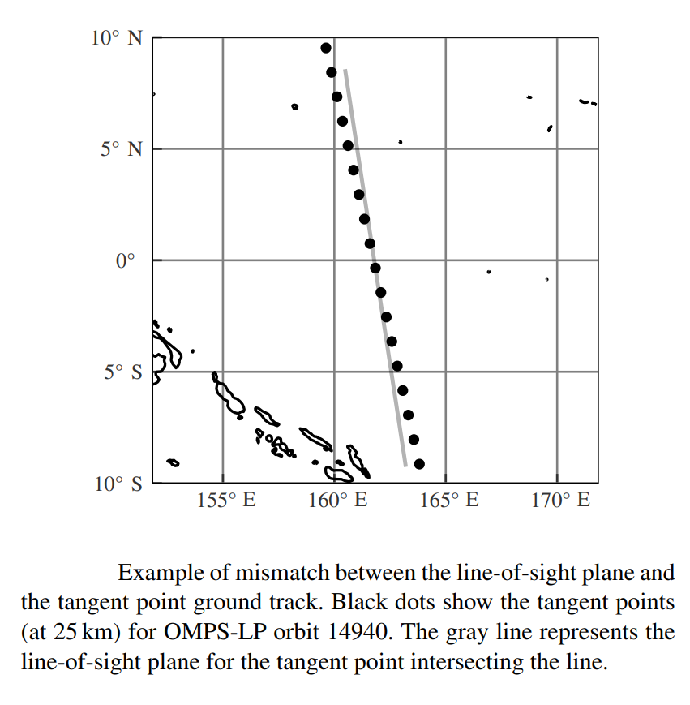

.. _tomography_orbitalgrid:

######################
The Orbital Plane Grid
######################
A tomographic retrieval retrieves in two-dimensions, angle along the orbital plane and altitude, however there are
complications in both creating and using the grid.  The class :class:`~.OrbitalPlaneGrid`
handles all aspects of the grid.  The grid forms a core part of the retrieval, and is used in both the retrieval and the
radiative transfer calculation.

Constructing the Grid
=====================
The general problem is we have a ground track of tangent points from an instrument that we wish to construct the
orbital plane grid from.  The ground track does not form a plane due to the rotation of the Earth.  The grid can
be constructed with::

    # Optical axis is a list of OpticalGeometry objects defining the mean of each image
    grid = OrbitalPlaneGrid(optical_axis, np.arange(500, 100000, 1000), placementtype='uniform', extend=10)

Here the grid is constructed in the 'uniform' mode, where the grid points do not necessarily line up with the exact
image tangent locations.  This allows for both downsampling and upsampling of the grid relative to the image tangent
points.  There is a second placementtype which matches the grid to the tangent points, however generally it is
recommended to use the uniform placement mode.  The grid is also extended by 10 degrees on each side, this is important
so that the retrieval can better handle edge effects.

Grid Interpolation
==================
Commonly it is required to interpolate to (and less commonly, from) the grid.  One example is ancillary data specified
at image locations along the orbit track that needs to be interpolated to the grid.  Other examples are upper bound
or lower bound altitudes that are calculated for each image which then need to be interpolated to the actual retrieval
grid.  The :class:`~.OrbitalPlaneGrid` offers methods which performs both of these interpolations.

Grid Line of Sight Mismatch
===========================
An instrument that looks directly along the satellite velocity vector will have a slight mismatch between the
traced groundtrack and the line of sight vector.

The mismatch is caused by the rotation of the Earth and is a few degrees depending on the exact orbit and latitude.
An instrument can point slightly offset from the satellite velocity vector in order to almost entirely eliminate
the mismatch but it requires adjusting the pointing angle along the orbit.
